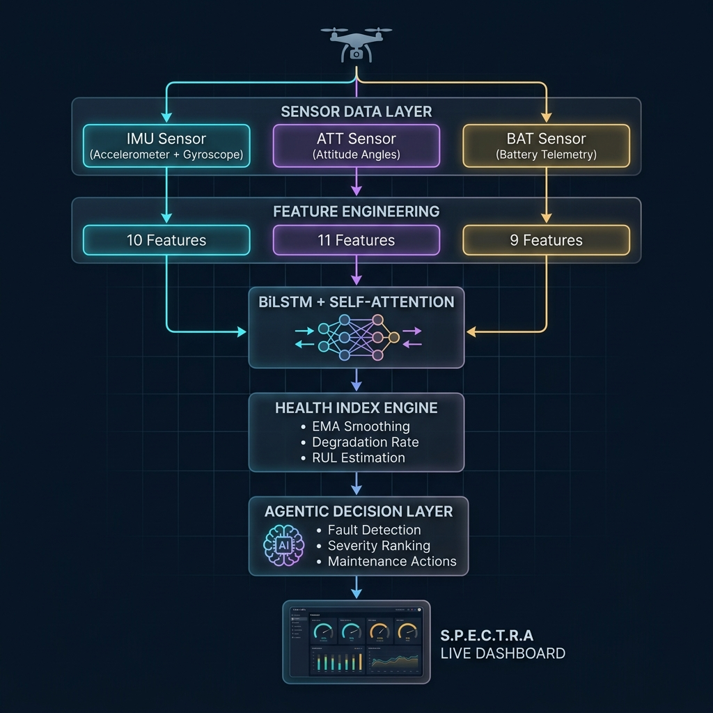

<div align="center">

# ✈ S.P.E.C.T.R.A

### **S**ensor **P**rognostics & **E**dge **C**omputing for **T**elemetry-based **R**eal-time **A**nalysis

**Intelligent Edge Computing for UAV Predictive Maintenance in Real Time**

[](https://python.org)
[](https://pytorch.org)
[](https://flask.palletsprojects.com)
[](LICENSE)
[](https://ansu647.github.io/SPECTRA-UAV-PHM/)

<br/>



<br/>

*A real-time Prognostics and Health Management (PHM) system for autonomous UAVs, powered by BiLSTM+Attention deep learning models and an agentic decision layer for predictive maintenance.*

</div>

---

## 🚀 Overview

**S.P.E.C.T.R.A** is an end-to-end UAV health monitoring system that processes live telemetry from three critical sensor subsystems — **IMU** (Inertial Measurement Unit), **ATT** (Attitude), and **BAT** (Battery) — through deep learning models to predict component failures before they happen.

The system features a **stunning real-time web dashboard** that visualizes sensor health, degradation trends, Remaining Useful Life (RUL), and automated maintenance recommendations through an intelligent agentic decision layer.

### Key Capabilities

| Feature | Description |
|---------|-------------|
| 🧠 **BiLSTM + Self-Attention** | Bidirectional LSTM with additive attention for temporal anomaly detection |
| 📊 **Real-time Dashboard** | Flask + SSE-powered live monitoring with smooth gauge animations |
| ⚡ **Agentic Decision Layer** | Context-aware fault diagnosis with dynamic urgency classification |
| 🔄 **Health Index Tracking** | EMA-based normalized health indices with degradation rate monitoring |
| 🛡️ **Fault Injection Engine** | Simulated motor degradation and power stress for validation |
| 📈 **RUL Estimation** | Linear extrapolation-based Remaining Useful Life computation |

---

## 🎮 Live Demo

> **[▶ Launch S.P.E.C.T.R.A Demo on GitHub Pages](https://ansu647.github.io/SPECTRA-UAV-PHM/)**

The demo replays pre-recorded inference data from the BiLSTM+Attention models with the same smooth dashboard animations as the live system.

---

## 🏗️ System Architecture

```
┌────────────────────────────────────────────────────────┐
│                   SENSOR DATA LAYER                    │
│  IMU.csv (Acc/Gyr)  │  ATT.csv (Angles)  │  BAT.csv   │
└──────────┬───────────┴──────────┬─────────┴────┬───────┘
           │                     │               │
     ┌─────▼─────┐        ┌─────▼─────┐   ┌─────▼─────┐
     │  Feature   │        │  Feature   │   │  Feature   │
     │Engineering │        │Engineering │   │Engineering │
     │ 10 feats   │        │ 11 feats   │   │  9 feats   │
     └─────┬──────┘        └─────┬──────┘   └─────┬──────┘
           │                     │                 │
     ┌─────▼─────┐        ┌─────▼─────┐   ┌─────▼─────┐
     │  BiLSTM   │        │  BiLSTM   │   │  BiLSTM   │
     │+Attention │        │+Attention │   │+Attention │
     └─────┬──────┘        └─────┬──────┘   └─────┬──────┘
           │                     │                 │
     ┌─────▼─────────────────────▼─────────────────▼─────┐
     │              HEALTH INDEX ENGINE                   │
     │  EMA Smoothing → Degradation Rate → RUL → Status  │
     └──────────────────────┬────────────────────────────┘
                            │
     ┌──────────────────────▼────────────────────────────┐
     │           AGENTIC DECISION LAYER                  │
     │  Severity Ranking → DR Tiebreak → Dynamic Faults  │
     │  Context-Aware Actions → Confidence Scoring        │
     └──────────────────────┬────────────────────────────┘
                            │
     ┌──────────────────────▼────────────────────────────┐
     │          S.P.E.C.T.R.A LIVE DASHBOARD             │
     │  Flask + SSE → Smooth Gauges → HI Chart → RUL Bar │
     └───────────────────────────────────────────────────┘
```

---

## 📂 Project Structure

```
S.P.E.C.T.R.A/
├── dashboard.py         # 🖥️  Live monitoring dashboard (Flask + SSE + embedded HTML)
├── final_model.py       # 🧠  Main PHM engine — BiLSTM+Attention + Agentic layer
├── lstm_imu.py          # 📡  Standalone IMU model training & evaluation
├── lstm_att.py          # 🧭  Standalone Attitude model training & evaluation
├── lstm_bat.py          # 🔋  Standalone Battery model training & evaluation
├── IMU.csv              # 📊  IMU sensor telemetry dataset
├── ATT.csv              # 📊  Attitude sensor telemetry dataset
├── BAT.csv              # 📊  Battery sensor telemetry dataset
├── index.html           # 🌐  GitHub Pages static demo (pre-recorded data)
├── spectra_architecture.png  # 📋  System architecture diagram
├── requirements.txt     # 📦  Python dependencies
└── README.md            # 📖  This file
```

---

## ⚡ Quick Start

### Prerequisites

- Python 3.10+
- pip

### Installation

```bash
# Clone the repository
git clone https://github.com/ansu647/SPECTRA-UAV-PHM.git
cd SPECTRA-UAV-PHM

# Install dependencies
pip install -r requirements.txt
```

### Run the Live Dashboard

```bash
python dashboard.py
```

This will:
1. Load sensor data from CSV files
2. Load/train BiLSTM+Attention models (cached as `.pt` files after first run)
3. Launch a Flask server at **http://localhost:8050**
4. Auto-open the S.P.E.C.T.R.A dashboard in your browser
5. Stream real-time inference results with smooth animations

### Run the Terminal-Based PHM Engine

```bash
python final_model.py
```

Outputs an ANSI-colored terminal dashboard with live health tracking, RUL estimation, and maintenance recommendations.

### Train Individual Sensor Models

```bash
python lstm_imu.py    # Train IMU model
python lstm_att.py    # Train Attitude model
python lstm_bat.py    # Train Battery model
```

---

## 🖥️ Dashboard Features

| Component | Description |
|-----------|-------------|
| **Circular Gauges** | Per-sensor health index with WARNING/CRITICAL threshold markers |
| **Health Chart** | Real-time 3-line chart tracking all sensor HI values |
| **RUL Bar** | Composite worst-case Remaining Useful Life with shimmer animation |
| **Agentic Panel** | Dynamic fault detection, priority sensor, fastest-degrading sensor |
| **Per-Sensor Strip** | Live HI + degradation rate snapshot for all subsystems |
| **System Status** | Animated NORMAL → WARNING → CRITICAL badge with glow effects |
| **Trend Badge** | STABLE / DEGRADING system-wide trend indicator |

---

## 🧠 Model Architecture

### BiLSTM + Self-Attention

```
Input (seq_len=15, features=N)
       │
  ┌────▼────┐
  │ BiLSTM  │  2 layers, hidden=64, dropout=0.3
  │ (→ + ←) │  Output: (batch, seq, 128)
  └────┬────┘
       │
  ┌────▼──────────┐
  │Self-Attention │  Additive (Bahdanau) attention
  │  W·tanh(V·h)  │  Learns temporal importance
  └────┬──────────┘
       │
  ┌────▼────┐
  │   FC    │  128 → 64 → output_dim
  │ Layers  │  ReLU + Dropout
  └─────────┘
```

### Engineered Features per Sensor

| Sensor | Features | Count |
|--------|----------|-------|
| **IMU** | AccX/Y/Z, GyrX/Y/Z, vibration magnitude, ZCR(Acc), ZCR(Gyr), jerk | 10 |
| **ATT** | Roll, Pitch, Yaw, DesRoll, DesPitch, DesYaw, roll_err, pitch_err, yaw_err, total_track_err, Δyaw | 11 |
| **BAT** | Volt, Curr, CurrTot, EnrgTot, Temp, power, SoC, ΔVolt, ΔTemp | 9 |

---

## 🔧 Configuration

Key parameters in `final_model.py`:

| Parameter | Default | Description |
|-----------|---------|-------------|
| `SEQ_LEN` | 15 | LSTM input sequence length |
| `EMA_ALPHA` | 0.08 | Health Index smoothing factor |
| `EPOCHS` | 15 | Training epochs |
| `BATCH_SIZE` | 32 | Training batch size |
| `FAULT_INJECT` | True | Enable/disable fault simulation |

Dashboard config in `dashboard.py`:

| Parameter | Default | Description |
|-----------|---------|-------------|
| `STEP_DELAY` | 0.55s | Interval between inference steps |
| `REPLAY` | True | Loop dashboard after completing all steps |
| `PORT` | 8050 | Flask server port |

---

## 📊 Health Status Classification

| Status | Condition | Action |
|--------|-----------|--------|
| ✅ **NORMAL** | HI < 1.20, DR < 0.003 | Routine monitoring |
| ⚠️ **WARNING** | HI > 1.20 or (HI > 1.10 & DR > 0.003) | Schedule inspection |
| 🚨 **CRITICAL** | HI > 1.55 or (HI > 1.35 & DR > 0.006) | Immediate grounding |

---

## 🛠️ Tech Stack

- **Deep Learning**: PyTorch (BiLSTM + Self-Attention)
- **Data Processing**: Pandas, NumPy, scikit-learn
- **Dashboard Backend**: Flask + Server-Sent Events (SSE)
- **Dashboard Frontend**: Vanilla HTML/CSS/JS + Chart.js + Canvas gauges
- **Design System**: Orbitron + Inter + JetBrains Mono fonts, glassmorphism UI

---

## 📜 License

This project is licensed under the MIT License — see the [LICENSE](LICENSE) file for details.

---

<div align="center">

**Built with 🧠 Deep Learning & ✈️ Aviation Engineering**

*S.P.E.C.T.R.A — Keeping UAVs flying safe, one prediction at a time.*

</div>
